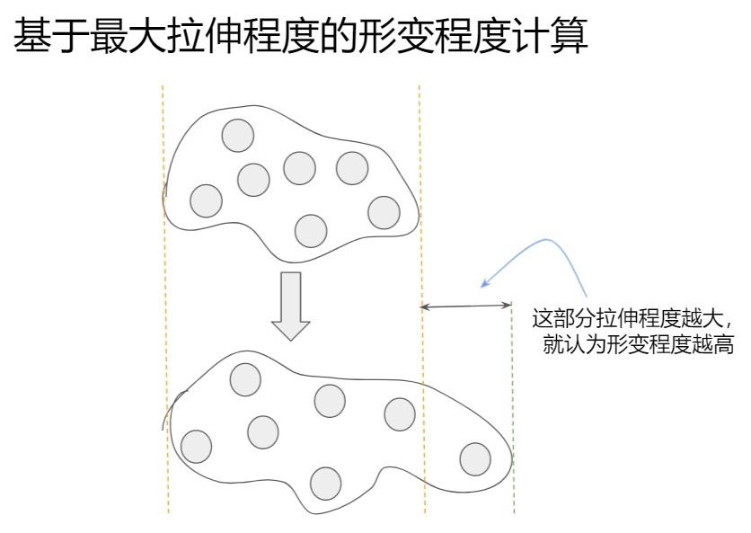
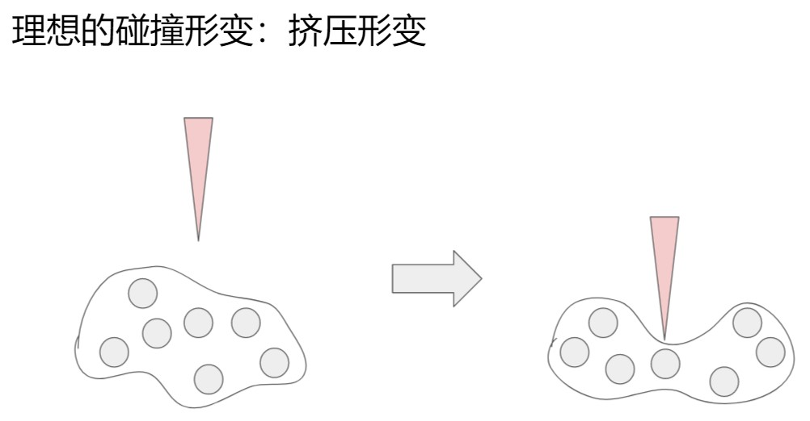
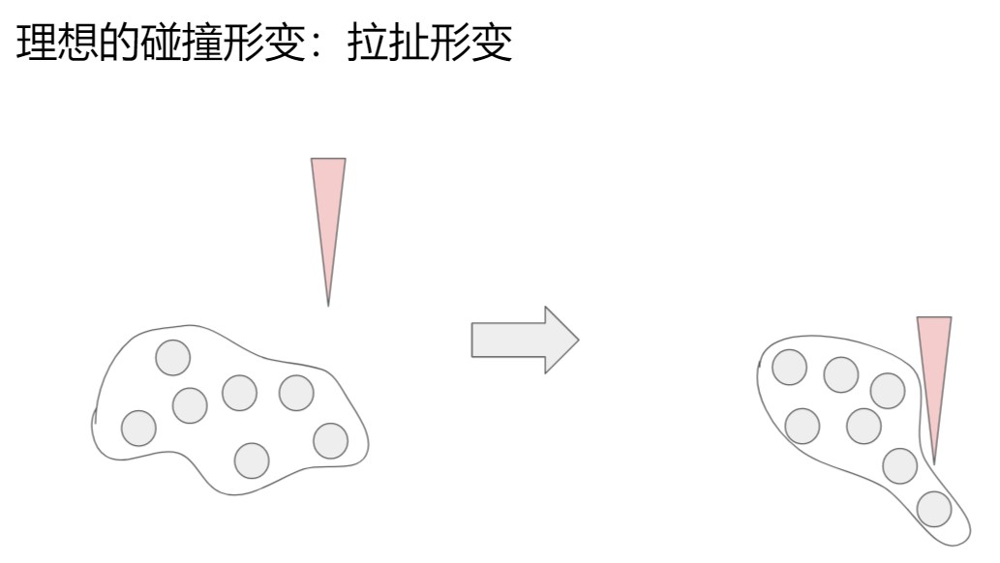
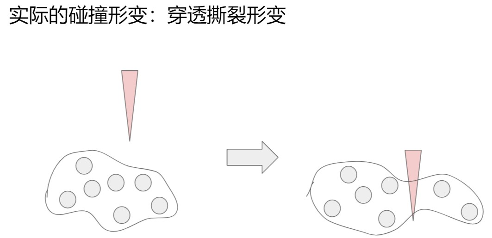
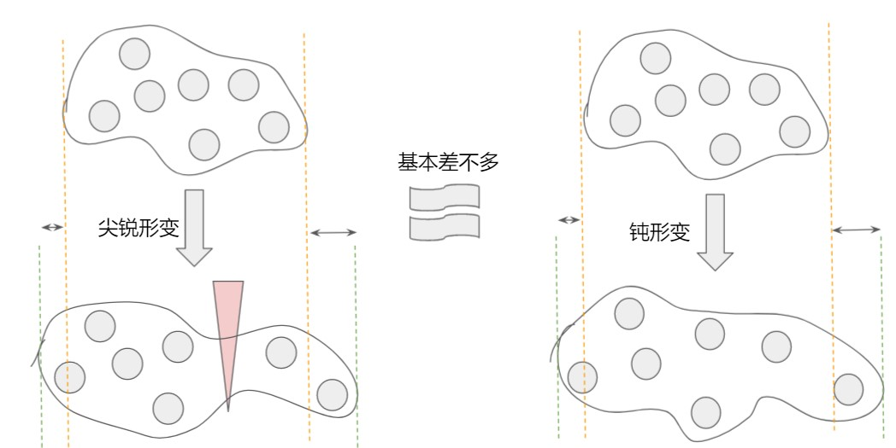
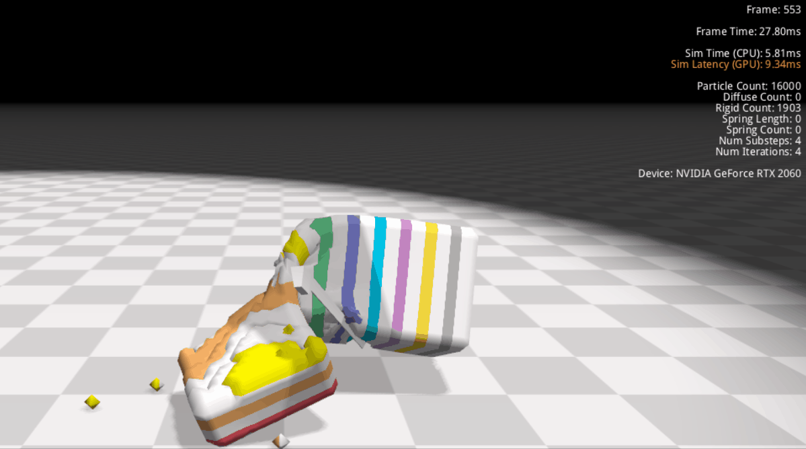
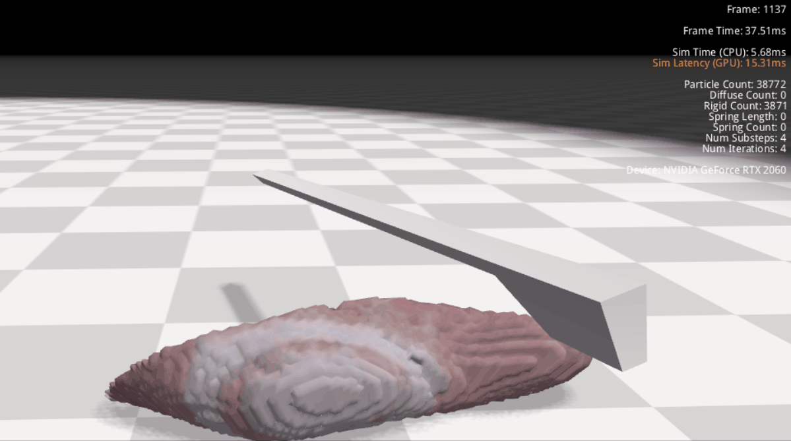

为了引入切割工具和物体的碰撞，我们不能再使用直接基于粒子到切割路径的距离的破坏检测方法了。

原方法直接计算每个粒子到切割路径的距离，如果距离小于某个阈值就认为该粒子被破坏。该方法下靠近切割工具的粒子被立即消除，导致切割工具与物体并不会发生碰撞。

故而想要找到的新方法是能允许物体与切割工具发生碰撞，并且只有在物体因与切割工具的碰撞而发生剧烈形变的情况下才破坏物体。
下文将讨论新方法。


# 一、初始方案：将簇的最大拉伸程度当作形变程度
最开始的方案是参照文献3里的做法，计算每个簇的最大拉伸程度，如果该值很大就认为该簇发生了破坏。具体的计算方法我放在了附录A中，概括来说就是对所有粒子形变后位移和形变前位移的零均值协方差进行SVD分解，其绝对值最大的特征值就是最大拉伸程度。



如上图所示，上方的簇为原来的簇，下方的簇为形变后的簇，因为主要是横向被拉长，所以就取横向被拉长的程度作为该簇的形变程度。

伪代码如下：

```c++
for each cluster:
	if the stretch magnitude is large:
		the cluster is fractured
```

该方案最大的问题是它算出来的是一个簇内的所有形变，但碰撞引起的往往都是局部的尖锐形变。

## 实际的形变：穿透撕裂形变
要解释该问题，得先看一下碰撞引起的形变到底是怎样的。

物体与切割工具碰撞引起的形变在我之前的假设中是这种类型的：




但经过实验验证，发现其实是这样的：



其实这很合理，shape-matching约束会让各粒子到goal position的距离的加权平方和尽量小。因为我们的切割工具是很细的“刀”，所以显然比起被挤压，还是被撕裂要更好：如果是被挤压的话，相当于粒子要向下运动一个刀的高度，而被撕裂的话，相当于粒子向左/右合计运动一个刀的宽度。那显然粒子会选择向左/向右运动（当然还是会有一些向下运动的，并没有那么绝对，只是撕裂形变占主要成分）


## 尖锐形变与钝形变
这里我们要引入两个概念：尖锐形变、钝形变
* 尖锐形变：物体的某个很小的局部发生了极大的形变。
* 钝形变：物体的某一块比较大的局部发生了较小的形变。

显然上一节中的穿透撕裂形变是尖锐形变，而不是钝形变。但是最大拉伸程度并不区分这两种形变，如下图：



上图中左边是由刀刃引起的穿透撕裂形变，是一种尖锐形变。而右边则是因为物体被左右拉伸而引起的钝形变。如图所示，两种情况下物体的被拉伸程度是差不多的，所以用最大拉伸程度当作形变程度的话，左右两种形变是差不多大小的。


## 阈值设定问题
因为使用最大拉伸程度的方法无法区分尖锐形变和钝形变，这就会在我们设定形变阈值的时候产生麻烦（我们需要设定一个形变阈值，如果一个簇的形变程度超过该阈值就认为该簇被破坏）。

例如下图为阈值设得过小的时候。观察该gif的最后一段，掉到地上的那截立方体掉落到地上后因为自身弹性而在内部会有一个震荡的形变，该形变为钝形变，但也被我们纳入了计算，从而超过了设定的阈值，这就导致明明手术刀没有碰撞到那截立方体却也发生了切割：



而如果试图通过调大阈值来解决问题的话，那物体并不具有很大钝形变时，本来该被切开的地方又没被切开了，如下图：




## 总结
所以归根结底是因为把最大拉伸程度当作形变程度的这一方法无法区分我们想要的尖锐形变和不想要的钝形变导致的问题。


# 二、修改后的方案：将粒子到邻居距离当作形变程度
上一部分中提到物体与切割工具碰撞引起的形变以穿透撕裂形变为主导。我注意到，这类形变与钝形变最大的区别是粒子到其邻居的距离：穿透撕裂形变中有个别粒子到其邻居的距离极大，而其他粒子到邻居距离都很小；钝形变中所有粒子到其邻居的距离都适中。

以此为灵感，我想到的是以粒子到邻居距离作为形变程度，这样就能区分开来尖锐形变和钝形变了。

伪代码如下：

```c++
for each particle:
	for each neighbor:
		dist = Distance(particle, neighbor);
		if dist > DIST_EPSILON:
			Remove the particle.
```

该算法目前的实现和伪代码基本一致，非常的平凡，不再详细展开。


## 效果

[](2021-08-17-切割效果.mp4 ':include :type=video controls')

视频中最开始是无重力环境，这样能更明显地看到物体与切割工具的碰撞效果。视频最后又开启了重力。

可以看到，切面还是比较光滑平整的，碰撞效果也是比较明显的，切割时刀刃附近的物体也确实会发生形变。

不过也可以看到，视频中速度非常慢(300~400ms/frame)，这是因为：
* 目前的实现比较慢
* 因为需要保证一般的钝形变下粒子到邻居距离不会超过设定的距离阈值（该阈值根据刀刃的宽度来定，至少要比刀刃宽度小一点点，否则就切不开来了），所以粒子之间的间距受制于刀刃宽度，得设定得很小。这就导致同样大小的物体会需要比较多的粒子。（当然，也可以通过调大粒子大小来减少粒子数量，但是那样的话物体刚性就会上来了。也就是说，因为粒子间距被限制住了，所以物体刚性越弱，粒子数量就越多，计算量就越大）


## 缺点分析
最明显的缺点是该方案会导致刀刃宽度、物体刚性与粒子数量呈负相关的关系：刀刃越窄，就需要越多粒子；物体刚性越弱，就需要越多粒子。计算量会跟切割工具和物体刚性挂钩。

然后视频中看不出来的一个缺点是它不允许切割工具的高速运动，如果切割工具运动过快的话，那就不会发生切割了。该缺点的本质是碰撞检测中的penetration问题：切割工具上一帧还在物体外呢，下一帧突然整个切进了物体内部，粒子来不及运动逃离，于是就被关在了切割工具内部，而进到了切割工具内部的粒子显然无法正确形变。
* 不过该问题应该是所有基于形变程度的破坏检测方法的通病，或许目前不是那么重要。
* 解决方法可以是使用Continuous Collision Detection那类的方法，也可以是当切割工具高速运动时改为使用别的破坏检测方法，也可以是通过提高帧率来缓解问题。


## 总结
将粒子到邻居距离作为形变程度的方法在切割这一场景下具有良好表现：
* 切面光滑
* 碰撞明显

但它要求更高的粒子密度，从而增大了计算量。并且该方法只在切割工具低速运动的情况下才有效。

目前打算先想办法加速：
* 加速目前的实现
* 降低粒子密度的需求，从而降低计算量


# 附录A. 簇最大拉伸程度的计算
我们每个阶段可以从flex那里得到各粒子的deformed positions（形变后位移），并且对柔体建模的时候我们就存下来各粒子的rest positions（形变前位移）。利用这两个量就足以判定簇的形变程度了，下面进行推导。

## Defination
Let the *i*th particle's deformed position to be $x^*_i$(column vector), and its rest position to be $r^*_i$

Use $\overline{x^*}$ for the means of $x^*_i$: $\overline{x^*} = \frac{1}{n} \sum_i x^*_i$.
And the same for $\overline{r^*} = \frac{1}{n} \sum_i r^*_i$

Let $x_i = x^*_i - \overline{x^*}$, and $x = \begin{bmatrix}
	x_1, x_2, \cdots, x_n
\end{bmatrix}$. And the same for $r_i, r$

Now $x, r$ are zero-mean random variables. This feature will be used later.


## Goal Position
The magnitude of deformation using shape-matching method can be define as the stretch extent between the deformed position and the goal position.

In shape-matching method, the goal position is computed as(refer to literature 1):

$$
	g_i = Rr_i
$$

$R$ is the result of polar decomposition on the best transformation $A = RS$. And $A$ is computed by minimize the least square sum:

$$
\min_A \sum_i m_i(Ar_i - x_i)^2
$$

where $m_i$ is the mass of *i*th particle. Derivates the expression:

$$
\begin{aligned}
	\frac{\partial(\sum_i m_i(Ar_i - x_i)^2)}{\partial A} \\
	= \sum_i 2m_i (Ar_i - x_i)r_i^T
\end{aligned}
$$

Let it to be zero, we can solve $A$:

$$
\begin{aligned}
	A &= \sum_i(x_ir_i^T)(\sum_i(r_ir_i^T))^{-1} \\
	&= xr^T(rr^T)^{-1}
\end{aligned}
$$

Note, $x, r$ are zero-based random variables, so the covariance between them is:

$$
	Cov(x, r) = \sum_i(x_ir_i^T)
$$

And the variance of $r$ is:
$$
	Cov(r, r) = \sum_i(r_i r_i^T)
$$

So $A$ in another form can be:

$$
	A = Cov(x, r) Cov(r,r)^{-1}
$$

This is why the literature 2 uses the covariance matrix for the calcualtion of best rotation. The using of 'covariance matrix' may be ambiguous, since the covariance matrix always refer to the matrix of covariances between two sets of random variables. However, in literature 2, they are just using the covariance between $x$ and $r$, which is a matrix.


## The magnitude of stretch
Now we have the best transformation $A$ containing rotation and scaling.

Refer to the literature 3 and [my blog](https://zhuanlan.zhihu.com/p/397600286), we know the singular values of $A$ are the magnitudes of stretch and the right-singular vectors are the stretch directions.

## Degenerate Condition: $r_i r_i^T$ is a zero matrix
If $r_i r_i^T$ is a zero matrix, the cluster is just a point. So of course there is no deformation.


# 附录. 参考文献
1. 2005 Meshless Deformations Based on Shape Matching
2. 2014 Unified particle physics for real-time applications
3. 2016 Ductile Fracture for Clustered Shape Matching