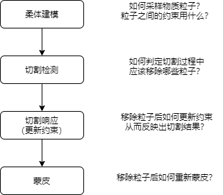
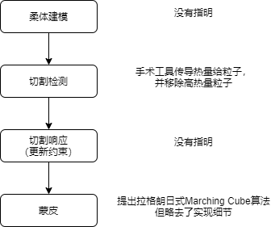
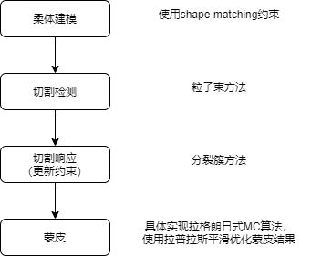

# 一、参考论文、贾学长、我的工作
切割问题的总体流程（后文中的工作都是按这个流程走的）（时步迭代等大家都没有做新工作的部分就省略掉了）：

## 1. 参考论文的工作(2017 Efficient Surgical Cutting with Position-Based Dynamics)
* 使用粒子建模柔体，基于PBD进行物理仿真：但是这一部分他并没有指明建模时使用的是mass spring还是shape matching。
* 使用热传导计算的方法来检测哪些粒子需要被移除：手术工具会传导热量给粒子，当粒子热量达到一定程度就被移除
* 通过移除粒子来实现切割：但这一部分他并没有讲明移除粒子后如何对应更新约束来反应切割结果。
* 提出一种拉格朗日式Marching Cube算法来实现蒙皮：在该方法中他略去了例如方向向量计算等细节，而只介绍了方法的大概思想。
* 除此之外，和我们目前工作无关的还包括力反馈计算，不过他也略去了反馈力计算的细节。

## 2. 贾世文学长的工作
* 使用shape matching方法来建模柔体：这一部分建模方法是直接使用的Flex demo里的代码（包括粒子采样与簇采样），不过贾学长修改了部分代码，从而在建模过程中嵌入了Marching Cube算法所需的数据结构。
* 提出“粒子束”方法来检测需要移除的粒子：一种几何方法。该方法不允许切割工具与物体的碰撞，而是将切割工具的运动轨迹抽象为一个空间平面，然后移除离该平面最近的那些粒子，从而实现切割。
* 通过分裂簇的方法来根据切割结果更新约束：该方法存在比较大的问题，会出现粒子黏连、孤立簇等错误。
* 具体实现拉格朗日式Marching Cube算法：贾学长填补了参考论文中叙述的空白部分，具体实现了该算法。不过代码实现存在性能问题。
* 使用网格平滑算法来提升网格质量：使用拉普拉斯平滑算法。同样地，这一部分的代码实现也存在性能问题。

## 3. 我的工作（包括未完成的）
* 通过检测“局部形变”来进行切割检测：替换掉了贾学长的粒子束方法。允许切割工具与被切割物体发生碰撞，然后检测物体表面的形变程度，当某个粒子周围发生大形变时就移除该粒子。
* 改进分裂簇方法，在这基础上并行化实现该方法：通过引入连通性的概念改进分裂簇方法，修正它本来存在的问题，并通过并行化实现来加速。
* 加速拉格朗日式Marching Cube算法的代码实现：修改了一些并行实现中的代码细节，提高了它的并行性，实现加速。

## *. 关于我未完成的工作
* 局部形变目前是使用粒子到其邻居的最大距离来度量的：该方法在简单场景中表现良好，但尚需在更多复杂场景进行验证并调整。
* 分裂簇方法的并行化实现中目前还存在一些待优化的部分：在缓慢切割一个肝脏的简单场景下（90k粒子、700簇），目前最快每帧40ms，大多数帧都在40~60ms左右，偶尔会有90ms的一帧出现。

## *. 目前效果

<video height=320 width=320 controls>
  <source src="demo.mp4" type="video/mp4">
</video>

# 二、关于小论文内容的问题
应该选取我和贾学长工作中的哪些内容作为小论文的contribution？

* 切割检测与切割响应部分：
  * 贾学长的粒子束方法与他的分裂簇方法之间有一定的依赖性，我的局部形变检测法与我改进的分裂簇方法之间也有一定的依赖性。因此要么这部分都用贾学长的方法，要么都用我的方法。
    * 贾学长的方法的依赖性：他的分裂簇算法假设了切面是一个平面，但我的局部形变检测法中不存在切面。
	  * 我的方法的依赖性：我的分裂簇算法假定簇是连通图，切割是破坏连通性的操作，但贾学长的粒子束方法并不考虑连通性，仅考虑粒子的几何位置。
  * 另一方面，我的方法中还有一部分工作没有完成：
    * 切割检测的局部形变检测法还需要在复杂场景下进一步验证调整
    * 分裂簇方法还存在帧率不稳定的问题有待优化
  * 贾学长的分裂簇方法中则存在一些严重的问题：切面两边的粒子相互黏连、没有被切到的部分却自己掉下来了等视觉上非常明显的错误。
  * 应该选取谁的方法作为小论文的contribution？
* 蒙皮部分：
  * 如果我的理解没有问题的话，贾学长应该并没有修改参考论文中提出的算法，而仅仅只是具体实现了它而已。
  * 但是贾学长的工作中也确实针对参考论文中的叙述空白提出了一些具体的计算方法。这部分是否应该算作contribution？