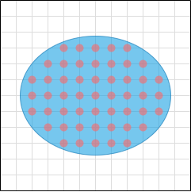

本文档介绍粒子、节点、簇的概念。

# 节点(Node) & 粒子(Particle)
我们将物体放在一个规则的三维网格中。

* 节点(Node)：这个三维网格的网格线与网格线的交点，被称为节点。
* 粒子(Particle): 如果一个节点位于物体内部，那么它就是一个粒子。

如图以二维的情况为例，在物体内部的节点被标记为红色，表示它们是粒子，而在物体外部的节点没有被标记（注：这里我们关于边界情况的处理并不严格，对落在物体边界的节点的处理可能与具体实现并不一致）：

# 簇(Cluster)
具体细节请参阅2005 Meshless Deformations Based on Shape Matching。

在我们的具体实现中，簇就是一个粒子集合，它表示这些粒子有保持此时的相对位置的趋势。我们通过簇的累叠来实现柔体变形。