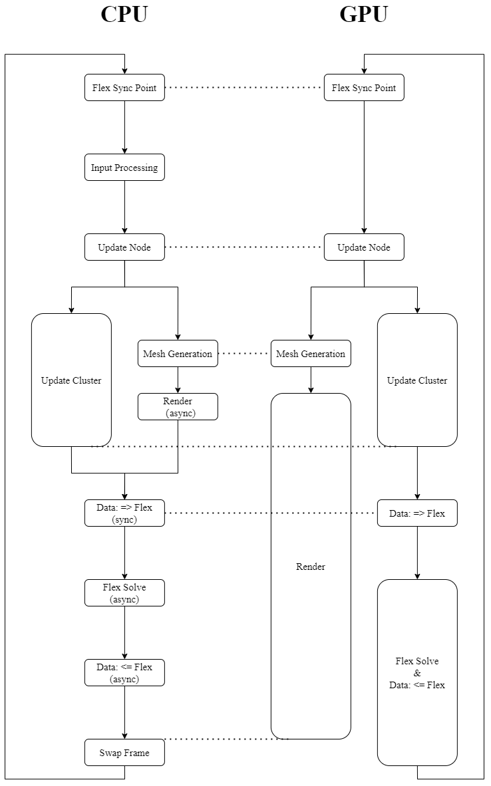
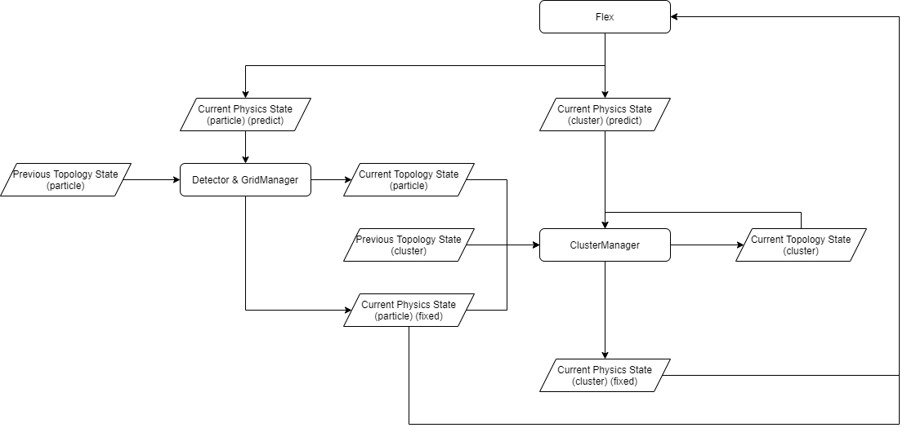
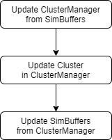
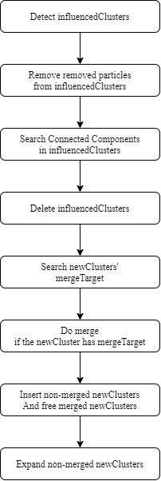
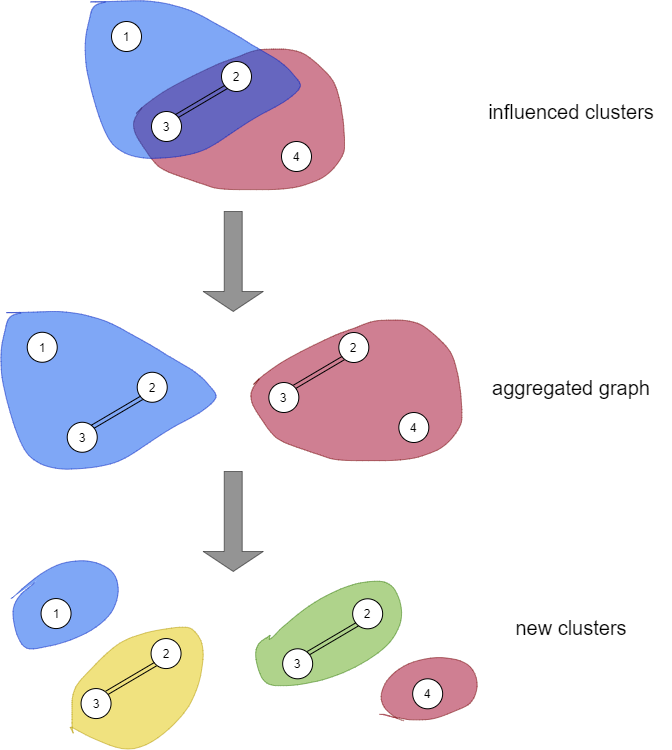

* Commit ID: ad5957ffd9a890dfbdb06eb3697c856e2e1d1478
* Last Edit Date: 2021-11-11

本文档介绍每帧更新的执行逻辑。

每帧更新的入口是`main.cpp`里的`UpdateFrame_simple`，一个被我简化过的函数。原来是`UpdateFrame`的，不过里面包含了很多我们用不上的内容（例如流体相关、场景切换），所以我就移除了那些、从而简化了逻辑。

# 每帧更新的总流程

每一帧需要处理/计算生成的数据有：
* 用户输入：键盘、鼠标、力反馈设备
* 物理状态：粒子位置、速度；簇位置、旋转
* 拓扑状态：节点的拓扑状态（哪些节点是否是粒子）；簇的拓扑状态（哪些簇包含哪些粒子）
* 物体网格：用于渲染物体的三角网格
* 渲染结果：根据用户输入和物体网格，渲染出来的一帧

关于粒子、节点、簇的概念请参见[Concept.md](Concept.md)。

注意：下图中块的大小与其执行时长无关。


各个阶段的简单介绍，其中有些会在后文中详细介绍：
* Flex Sync Point：CPU和GPU的同步点，在此处等待Flex完成当前帧物理状态的计算，并将当前帧物理状态从GPU拷贝回CPU。
* Input Processing: 处理设备输出，包括键盘、鼠标、力反馈设备。这些输入应是用户对上一帧渲染结果的反馈。
* Update Node
  * 破坏检测：根据当前帧的物理状态和用户输入，计算有哪些节点需要更新状态。
  * 破坏响应（前半）：根据当前帧物理状态、破坏检测的结果和上一帧节点的拓扑状态，计算当前帧节点的拓扑状态。
* Update Cluster：与Mesh Generation, Render并行
  * 破坏响应（后半）：根据当前帧物理状态、破坏检测的结果、当前帧节点的拓扑状态和上一帧簇的拓扑状态，计算当前帧簇的拓扑状态，从而完成当前帧拓扑状态的计算。
* Mesh Generation：根据当前帧的节点状态和粒子位置，生成物体网格。
* Render：根据当前帧的物体网格和用户输入，让OpenGL计算渲染结果。
* (Data: => Flex): 将当前帧的物理状态和拓扑状态从CPU发送到GPU，交给Flex。
* Flex Solve：根据当前帧的物理状态和拓扑状态，让Flex计算下一帧的物理状态。
* (Data: <= Flex): 从Flex获取下一帧的物理状态，并从GPU发送到CPU。
* Swap Frame：CPU和GPU的同步点，在此处等待OpenGL完成当前帧渲染结果的计算，并将当前帧渲染结果发送到显卡的输出缓冲中，完成帧交换。

第二次并行化工作中除了整体执行流的修改以外，就只有Update Node, Update Cluster, Mesh Generation有所修改。而Mesh Generation仅仅只是重构代码而已，并没有修改算法。所以接下来我只会进一步介绍Update Node和Update Cluster这两个部分。


# About State
因为关于物理状态(Physics State)和拓扑状态(Topology State)的更新比较复杂，所以单独做一个流程图来叙述：


如图，Flex每帧开头给出的物理状态都是一个预测(Predict)，而并不是当前帧实际的物理状态。因为拓扑结构的改变是会影响到物理状态的，例如很显然如果我删掉一个簇的话，那这个簇对应的物理状态就不存在了。所以每帧我们都会在更新拓扑状态之后修正(Fix)物理状态。
* 这个因为比较冗余，为了清晰简洁，单独在这一节描述，而没有在上一节的总流程图中写出来


# Update Node
该阶段分为两步：破坏检测和破坏响应（前半）。

## 破坏检测
我们采用基于粒子间距离的破坏检测算法，关于为何选取该方法和该算法的原理请参见[基于形变程度的破坏检测.md](../ContactCut探索/基于形变程度的破坏检测.md)，本文档中只会阐述其并行化实现。

因为判断依据是每个粒子到其邻居的最大距离，所以该过程是每个粒子相互独立的。因此我们可以将其简单并行化，伪代码如下：

``` c++
for each thread i in [0, particleNum):
	for each neighbor j of particle i:
		if Distance(i, j) > distEpsilon:
			mask[i] = true;
			break;
```

其中，`particleNum`为粒子数量，`Distance`为根据粒子索引计算两粒子距离的函数，`distEpsilon`为我们设定的距离阈值，`mask`为初始值为假的表示粒子是否该被移除的标记数组。

我们仅仅只是把原来遍历粒子的for循环改成一个线程处理一个粒子，因为粒子之间不存在读写冲突，所以不需要任何额外的处理。

## 破坏响应（前半）：更新节点的拓扑状态
因为我们是用逐节点的布尔量表示节点是否是粒子的，所以该过程仅仅只是将破坏检测中被标记的粒子的布尔量置否而已。我们简单地一个粒子一个线程地进行更新。

我们使用GridManager来维护节点的拓扑状态。


# Update Cluster
UpdateCluster步骤的目标是计算出当前帧簇的拓扑状态，并据此修正当前帧的物理状态。



总流程中有两样之前没提到过的东西：
* SimBuffers：就是当前帧物理状态。
* ClusterManager：用于维护簇的拓扑状态

为了编程的方便，ClusterManager会在内部维护一个簇列表，其中包括簇包含哪些粒子、这些粒子的restLocalPos(关于该坐标，在此处不作展开，详情请参阅代码)、簇的刚度系数(coefficient)、簇的旋转和位移。
* 拓扑状态：簇包含哪些粒子
* 物理状态：剩下的所有

展开流程图里的三步：
* 从SimBuffers中获取当前帧簇的旋转和位移（发生变动的物理状态），用其更新ClusterManager对应的簇的旋转和位移。
* 更新ClusterManager中簇的拓扑状态，也就是我们会增加/删去一些簇，或者从一些簇里面添加/移除粒子。新增的簇的物理状态根据旧簇的物理状态近似计算得到。
* 用更新完的ClusterManager反过来修正SimBuffers里存储的当前帧簇的物理状态。

关于第一步和第三步，主要麻烦的地方是我们在ClusterManager中使用的是懒惰删除：当我们删掉一个簇的时候，仅仅只是将其标记为invalid，之后这些位置会被新增的簇复用。所以在同步ClusterManager和SimBuffers时我们需要跳过这些invalid项。其他地方就直接看代码吧。

下面将进一步展开关于第二步更新簇的拓扑状态的过程，它是第二次并行化加速的关键部分。


## 更新簇的拓扑状态


算法流程是一个线性过程，它是基于[新簇划分算法.md](../新簇重构探索/新簇划分算法.md)改造出来的算法。因为改动还是比较大的，所以在此我将完整地阐述一遍。

### Detect influencedClusters
破坏检测给出被移除粒子的列表，Detect influencedClusters过程找出这些被移除粒子的所属簇，将它们称为influencedClusters。

该过程的核心是维护ParticleBelongList(粒子所属簇列表)，它表示“粒子->所属簇列表”的映射。因为同一个粒子可以从属的簇数量是不受限制，而且非常不平均的，可能有的粒子只属于一个簇，而有的粒子却属于几百个簇，所以如果使用固定大小的簇列表的话，就会非常浪费空间。

因此我们使用的是动态增长的簇列表，但问题是因为我们是将所属簇列表放在GPU端的，所以需要GPU端动态分配内存。但是目前CUDA所支持的[Dynamic Global Memory Allocation](https://docs.nvidia.com/cuda/cuda-c-programming-guide/index.html#dynamic-global-memory-allocation-and-operations)只允许比较小的内存分配，虽然可以通过调整limit来提高上限，但那非常受设备影响。所以最后我采用的方法是从CPU端调用CUDA API来分配一块极大的GPU端内存作为内存池，接下来GPU端的簇列表动态增长时再从这个内存池中取内存。
* TODO：目前内存池的实现非常朴素，就是让地址线性增长，并不会复用被free了的内存。以后可以考虑引入高级的内存管理结构。
* TODO：以及，因为内存池目前并不free，所以簇列表虽然会动态增长，但不会动态收缩，就是说它变长了以后就变不回来了。

ParticleBelongList的维护是在Insert/Delete Cluster时进行的，需要注意的是，我们为了性能而并没有让ParticleBelongList是thread-safe的，所以多线程更新的时候要避免访问冲突——最简单的方法是一个线程一个粒子，因为每个粒子的所属簇列表都是独立的，所以不会发生访问冲突。

而Detect influencedClusters就是简单地读取ParticleBelongList而已（这部分还有一些细节，例如毕竟不同的被移除粒子可能属于相同的簇，所以还是需要去重的，还请直接参见代码）。


### Remove removed particles from influencedClusters
分为三步：
* 构建被移除粒子的哈希集合
* 在influencedClusters中标记被移除粒子
* 流压缩移除被移除粒子

需要注意的是哈希集合的实现，因为没有现成的轮子，所以我是自己写了一个lock-free的hashset。它有两点要注意：
* device端的内存由host端调用CUDA API分配，一直都驻留(reside)在device端，并不会来回拷贝。虽然数据的内存由host端分配，但几乎所有的操作都是device函数。
  * TODO：这部分我应该写个博客，记录一下这种GPU数据结构的设计范式
* lock-free并不意味着cost-free，仅仅只是用原子操作来替代了显式原子锁而已（CUDA中应尽量避免使用显式锁，详情参见[我的博客]（https://zhuanlan.zhihu.com/p/418985780）），多线程Insert依然会产生同步开销，所以是个昂贵的操作。

其他部分直接看代码吧。


### Search Connected Components in influencedClusters
如果把cluster看成一张图(Graph)（无向图，为了简洁，以下略）的话，那我们的程序在整个过程中都将保证每个cluster都是连通图(Connected Cluster)，其具体原因请参见[新簇划分算法.md](../新簇重构探索/新簇划分算法.md)，简单来说就是因为后端我们使用Marching Cube算法生成网格的，而我们显然希望一个簇不要分成两个mesh、分离的两个簇也不要被mesh相连，而Marching Cube是根据节点连通性来生成mesh的，所以我们这里也要根据连通性划分簇。

而influencedCluster在被移除掉一些粒子后就不一定还是连通图了，我们要做的就是搜索其连通分量，把这些连通分量当作新产生的簇。

核心的SCC(Search Connected Components)算法请参阅2018 A High-Performance Connected Components Implementation for GPUs。
* 因为GPU多线程其实就类似分布式计算，所以union-based方法应该要比dfs-based方法更适合我们的场景。

核心的SCC算法需要的输入就是一个图的邻接表，输出是一组顶点列表，其中每个列表表示一个连通分量。所以接下来的问题是如何给出邻接表表示的图，以及如何根据顶点列表给出新簇。
* 后者的给出新簇目前的实现非常简单，就是让连通分量继承原cluster的旋转、位移、刚度，就这么形成了新簇。
* 我们接下来讨论前者：如何给出邻接表

要给出邻接表，就是要找出原cluster中每个粒子在这个cluster内的邻居，这就涉及到两个问题：
* 如何找出邻居：连通性是由节点的拓扑状态决定的，而节点的拓扑状态是由GridManager管理的，所以我们将这个问题委托给GridManager解决。细节请见代码。
* 如何界定这个邻居是否属于这个cluster：我们使用一个包括该cluster所有粒子的哈希集合来界定。

截止目前，我们有了一套搜索一个图的连通分量，并由这些连通分量生成新簇的方法。我们可以直接简单串行地一个个处理influencedCluster，但是显然每个influencedCluster都是独立的，所以其实该问题具有天然的并行性。

注意到如果我们认为同一个粒子属于不同簇时它就是两个粒子的话，那么不同influencedCluster互相之间就是不连通的，这意味着在这种假设下，我们直接对所有influencedCluster应用SCC算法时，能够直接得到所有influencedCluster的连通分量。



如上图，例如假设我们有两个cluster：A, B，它们分别包含粒子：
* A: 1,2,3
* B: 2,3,4

其中粒子2,3相连。我们将A里的2,3和B里的2,3认为是分开来的四个粒子，于是就得到了一个集成图(aggregated graph)，对这个集成图搜索连通子图，可以直接得到我们对A和B一个个搜索连通子图的结果。

备注：或许会觉得2,3应该被作为一个新簇产生，而不是两个。在这个例子中确实如此。问题的关键是我们应不应该保留原来cluster之间相互重叠的部分？例如我们其实也可以将influencedClusters里的所有粒子都视为相同的粒子（就是说A里的2,3和B里的2,3被视为是相同的两个粒子，而不做区分），这种情况下我们会将原本簇之间重叠的部分消除掉。这当然也是一种做法，不过目前因为我之后还有合并簇的操作会消除掉一部分重叠，所以此处我选择保留重叠，避免簇的数量急剧下滑。


### Delete influencedClusters
这一步目前仅仅只是串行地从ClusterManager的簇列表里移除influencedCluster而已。需要注意的地方是要维护ParticleBelongList。


### Search newClusters' mergeTarget
因为如果仅仅只是把influencedCluster的连通分量当作新簇的话，簇的数量是会一直膨胀下去的，而小簇的数量一多，物体就会变得更加柔软，这并不符合我们的期望。我们期望的是簇的数量尽量维持稳定，为此，生成的新簇需要首先尝试去被合并进其它簇中。

为了便于理解，这里先给出串行实现的伪代码：

```c++
for each newCluster c:
	for each particle i in c:
		for each neighbor j of i:
			for each cluster nc in the cluster belong list of j:
				if nc.size + c.size < CLUSTER_MAX_SIZE:
					Merge c into nc;
```

简单来说，我们查找新簇里所有粒子的邻居，检查这些邻居的所属簇中有没有还装得下新簇的，如果装得下的话就合并进去，否则就不合并。

----

这里的注意点是为什么合并以后能够保证连通性？因为我们的合并目标一定包含新簇里粒子的邻居，而一个簇里面的所有粒子之间都是互相可达的，故而新簇和合并目标内部都是连通的，而新簇里有一个粒子和合并目标里的粒子是邻居，所以这两个粒子互相可达，那么它们所属的连通分量合并起来以后也一定是个连通分量。下面形式化证明一下：

设新簇为$c$，合并目标为$nc$，新簇中的粒子$i$和合并目标中的粒子$j$是邻居。记$E(x,y)=true \iff x,y可达$。

$$
\begin{aligned}
	\because \forall x \in c: E(x, i)=true \\
	And, E(i, j) = true \\
	\therefore \forall x \in c: E(x, j) = true \\
	\because \forall y \in nc: E(j, y) = true \\
	\therefore \forall x \in c\  \forall y \in nc: E(x,y) = true \\
	\Rightarrow \forall x,y \in c \cup nc: E(x,y)=true
\end{aligned}
$$

----


很明显，这个串行算法里的for循环层数有那么点多，为了提升性能，我们需要提高一下并行性。注意：目前的并行实现比较naive，因为使用了cdp，所以性能并没有拉满。关于cdp的性能问题，请参阅[我的这段短文](https://www.zhihu.com/pin/1440715345312632832)。

简单的想法是我们让一个新簇对应一个线程，然后再在这个线程里面一个粒子一个线程。这里有两处可能的竞争：
* 两个新簇可能会想同时合并进同一个旧簇里面
* 一个新簇里面的两个粒子可能同时找到合适的合并目标

关于合并进同一个旧簇里面的问题，我们用一个atomicCAS来解决问题：
```c++
// c is the newCluster, nc is the potential mergeTarget
size_t oldSize;
size_t newSize;
do {
	oldSize = nc.size;
	newSize = oldSize + c.size;
	if(newSize >= CLUSTER_MAX_SIZE)
		break; // nc is too large to be mergeTarget
	
	// atomicCAS(addr, cmp, new): 
	//		[All in atomic]
	//		tmp = *addr;
	//		if(tmp == cmp)
	//			*addr = new;
	//		return tmp;
	if(atomicCAS(&(nc.size), oldSize, newSize) == oldSize) {
		// nc is c's mergeTarget
		// and nc's size has been set to newSize
		mergeTarget[c] = nc;
		break;
	}
} while(true);
```

注意到上面避免访问冲突的atomicCAS是将“检查是否有访问冲突”和“将合并目标的尺寸变大以容纳新簇”这两步合并在一起作为一步原子操作了。这也就是说，假设同一个新簇的两个粒子同时进行这个atomicCAS，如果它们是在通过合并目标的访问冲突检查后，再检查有没有同一新簇的其他粒子也通过了检查，想要设`mergetTarget[c] = nc`的话，那这两个粒子是没法回退的，因为`nc`的`size`已经被更改了。

因此`mergeTarget`的访问控制要在`nc.size`之前进行，我们给每个簇一把CAS锁，每个粒子只有拿到这把锁以后才能进行对`nc.size`进行`atomicCAS`尝试。将其写成伪代码：

``` c++
void Try_nc(c, nc) {
	// c is the newCluster, nc is the potential mergeTarget
	size_t oldSize;
	size_t newSize;
	do {
		if(searchedFlag[c])
			break;

		oldSize = nc.size;
		newSize = oldSize + c.size;
		if(newSize >= CLUSTER_MAX_SIZE)
			break; // nc is too large to be mergeTarget

		
		// atomicCAS(addr, cmp, new): 
		//		[All in atomic]
		//		tmp = *addr;
		//		if(tmp == cmp)
		//			*addr = new;
		//		return tmp;
		do {
			if(searchedFlag[c])
				break;

			// Try lock
			if(atomicCAS(&lock[c], 0, 1) == 0) {
				// Have mergetTarget[c]'s lock, so try nc.size

				if(atomicCAS(&(nc.size), oldSize, newSize) == oldSize) {
					// nc is c's mergeTarget
					// and nc's size has been set to newSize
					mergeTarget[c] = nc;

					// Succeed, tell other threads to finish
					searchedFlag[c] = true;
				}

				// No matter succeed or fail, just release the lock
				lock[c] = 0;
				// If succeed, we should finish our work, so break this lock's try-loop
				// If fail, maybe there is race on nc.size, so we break this lock's try-loop, and go to nc.size's try-loop.
				break;
			}
		} while(true);
	} while(true);
}
```

为了完整性，我们把这个函数放到大循环里面去：

```c++
for each newCluster c as a thread:
	lock[c] = 0;
	searchedFlag[c] = false;

	for each particle i in c as a thread:
		for each neighbor j of i:
			for each cluster nc in the cluster belong list of j:
				Try_nc(c, nc);
				if(searchedFlag[c])
					break;
			if(searchedFlag[c])
				break;
```


### Do merge if the newCluster has mergeTarget
为了性能，我们把实际的merge过程从SearchMergetTarget分离出来，单独进行。上面找到mergetTarget之后，仅仅只是做个标记，留到后面才进行实际的merge。
* 之所以这么做是因为SearchMergeTarget是对每一个newCluster进行的，但并不是每个newCluster都有机会merge，因此SearchMergeTarget所需的线程数（操作的簇的数量）与DoMerge所需的线程数并不相同，分成两步可能会更加高效。

实际的merge工作仅仅只是拷贝粒子列表而已，请参阅代码。

注意目前的实现是比较naive的，因为也使用了cdp。


### Insert non-merged newClusters And free merged newCluseters
如果newCluster已经合并进了某个旧簇中就把它所拥有的内存释放掉，否则就将其插入ClusterManager的簇列表中。这一步也没什么好讲的，目前的实现比较naive，唯一需要注意的点是要维护ParticleBelongList。


### Expand non-merged newClusters
因为新簇可能会变成孤立簇（虽然两个粒子是紧密相邻的，但是没有一个簇将它们直接或间接地联系在一起，导致它们两个在视觉上明明有相连的mesh，但是在物理上却并没有物体的内部作用力的现象），所以在分裂后，我们需要对没有合并进旧簇的newCluster进行拓展，让它们包含一些邻居。

目前的实现比较naive，就是简单的bfs，是一个个簇进行的串行算法。
